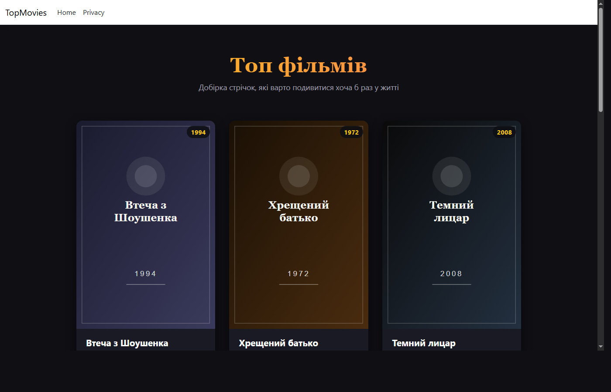
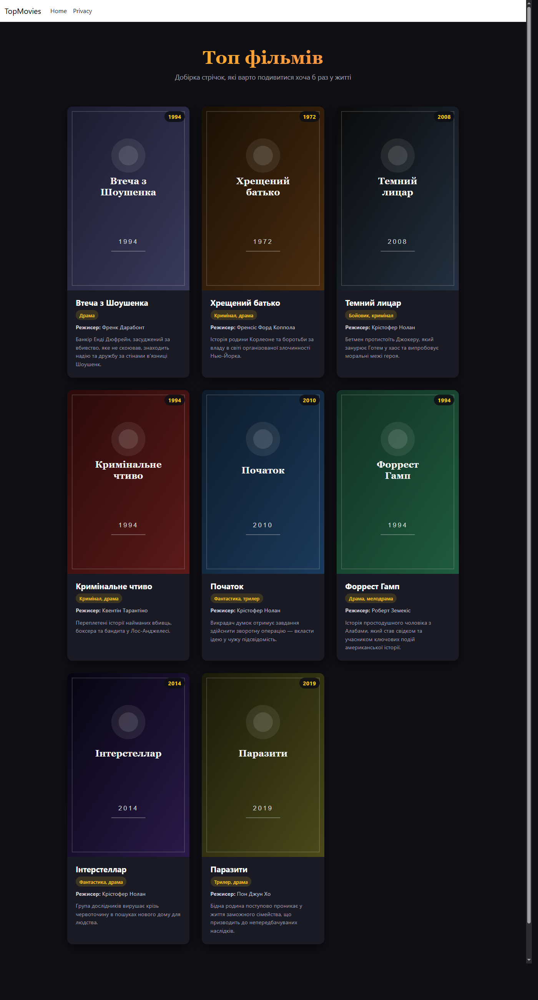
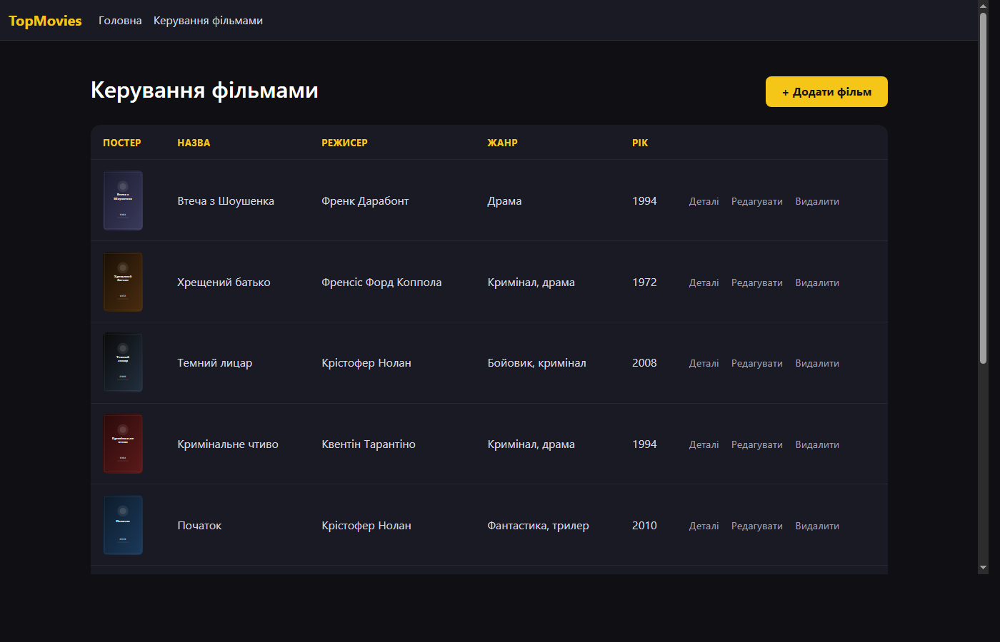
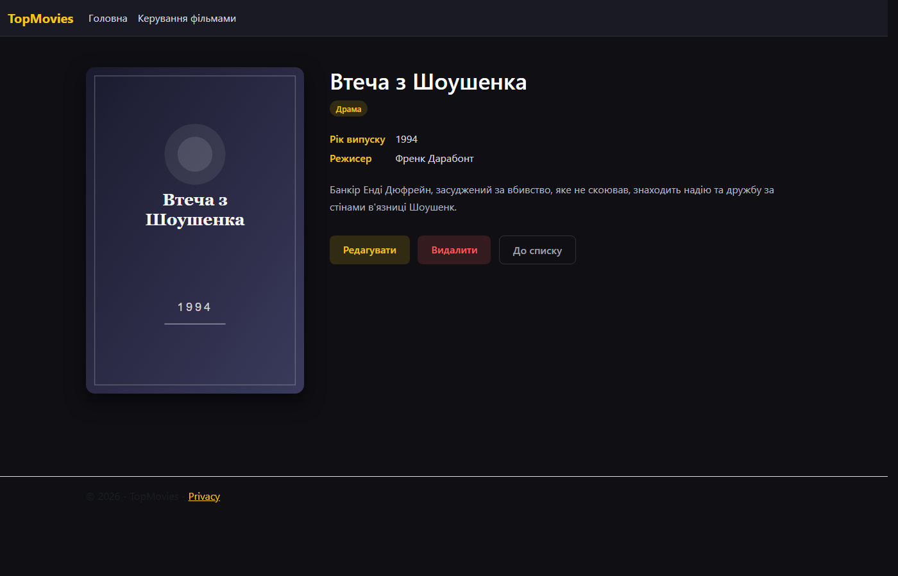
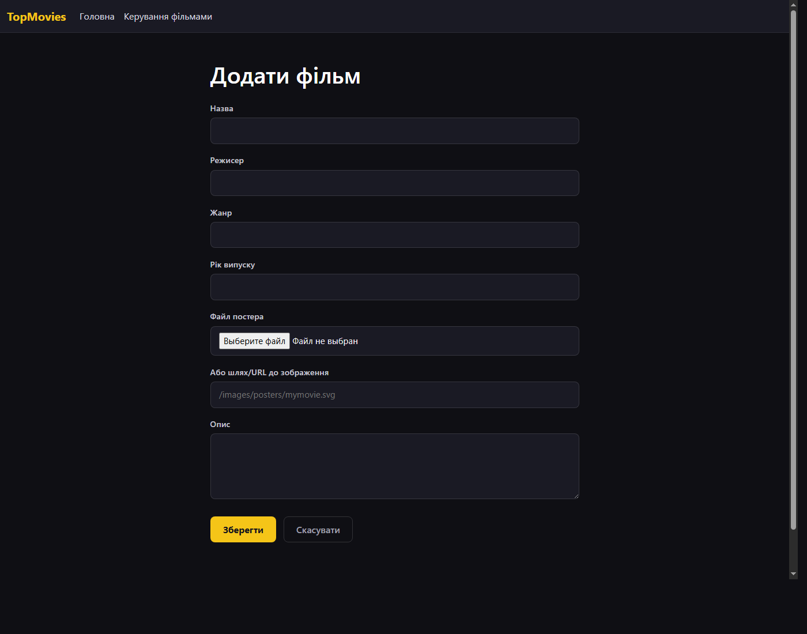
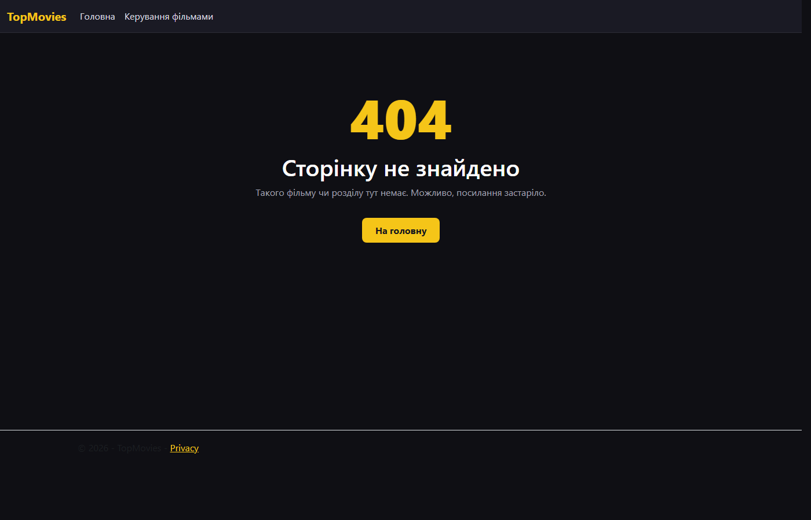
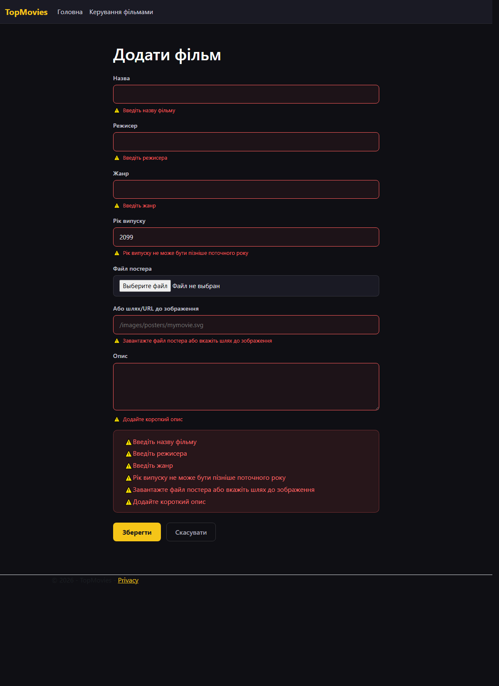

# TopMovies

Веб-додаток на ASP.NET Core MVC (.NET 9), який відображає добірку кращих фільмів
у вигляді стилізованої сітки з постерами та дозволяє керувати списком фільмів
(CRUD) через веб-інтерфейс.

## Дані

Дані про фільми зберігаються в **локальній базі даних SQL Server (LocalDB)** —
таблиця `Movies`, доступ через Entity Framework Core (`Data/MovieDbContext.cs`).
Початкові дані завантажуються через EF Core міграцію (`Migrations/`), а при
старті застосунку викликається `db.Database.Migrate()`, який автоматично
створює базу та застосовує міграції.

Для кожного фільму зберігається:

- назва
- режисер
- жанр
- рік випуску
- постер (файл, завантажений через форму, або шлях/URL до зображення)
- короткий опис

## CRUD-функціонал (`MoviesController`, `/Movies`)

- **Read** — `/Movies` (табличний список для керування) та головна сторінка
  `/` (стилізована сітка з постерами)
- **Details** — `/Movies/Details/{id}`: рік, режисер, жанр, опис, постер
- **Create** — `/Movies/Create`: форма з валідацією на клієнті та сервері
- **Update** — `/Movies/Edit/{id}`
- **Delete** — `/Movies/Delete/{id}` зі сторінкою підтвердження

**Завантаження постера файлом:** на формах Create/Edit можна або завантажити
файл зображення (`PosterFile`, зберігається у
`wwwroot/images/posters/uploads/`), або вказати шлях/URL вручну.

## Валідація

Валідація працює одночасно на сервері (DataAnnotations, перевіряється в
`ModelState.IsValid` перед збереженням) та на клієнті (jQuery Validate +
Unobtrusive Validation, підключені через `_ValidationScriptsPartial`).

**Вбудовані атрибути Data Annotations:** `[Required]`, `[StringLength]` (з
`MinimumLength`), `[Range]` — на властивостях `Movie` (`Models/Movie.cs`).

**Власні (кастомні) атрибути валідації** (`Validation/`):

- `NotFutureYearAttribute` — рік випуску не може бути пізніше поточного
  року. Реалізує `IClientModelValidator`, тому працює й на клієнті через
  власний jQuery-адаптер (`wwwroot/js/custom-validation.js`, метод
  `notfutureyear`), без перезавантаження сторінки
- `PosterRequiredAttribute` — крос-польова перевірка: постер обов'язковий,
  але допускається або завантажений файл (`PosterFile`), або текстовий шлях
  (`PosterPath`). Теж реалізує `IClientModelValidator` (адаптер
  `posterrequired`), що ревалідується при виборі файлу

**Тег-хелпери:** `asp-validation-for` (Validation Message Tag Helper) під
кожним полем і `asp-validation-summary="ModelOnly"` (Validation Summary Tag
Helper) над формою.

**Стилізація помилок** (`wwwroot/css/site.css`): червоний колір тексту та
рамки поля (`.input-validation-error`), іконка попередження (⚠) перед
повідомленням, плавна fade/slide-in анімація появи (`@keyframes
field-error-in`), стилізований блок `validation-summary-errors` з рамкою та
списком; порожній summary (`validation-summary-valid`) прихований.

**404-сторінка:** `UseStatusCodePagesWithReExecute` перенаправляє на
`/Home/NotFoundPage` для неіснуючих розділів/фільмів.

## Запуск

Потрібен встановлений SQL Server LocalDB (входить до Visual Studio /
SQL Server Express LocalDB). Рядок підключення в `appsettings.json`:

```
Server=(localdb)\MSSQLLocalDB;Database=TopMoviesDb;Trusted_Connection=True;...
```

```bash
dotnet run
```

База даних та таблиця створюються автоматично при першому запуску.
Додаток буде доступний на `http://localhost:5159`.

## Структура

- `Models/Movie.cs` — модель фільму з валідацією (Entity Framework сутність)
- `Validation/` — кастомні атрибути валідації (`NotFutureYearAttribute`, `PosterRequiredAttribute`)
- `wwwroot/js/custom-validation.js` — клієнтські jQuery-адаптери для кастомних атрибутів
- `Data/MovieDbContext.cs` — DbContext, seed-дані через `HasData`
- `Migrations/` — EF Core міграції
- `Controllers/HomeController.cs` — головна сторінка (сітка фільмів)
- `Controllers/MoviesController.cs` — CRUD-операції, завантаження постера
- `Views/Home/Index.cshtml` — головна сторінка із сіткою фільмів
- `Views/Home/NotFoundPage.cshtml` — кастомна 404-сторінка
- `Views/Movies/` — Index, Details, Create, Edit, Delete
- `wwwroot/css/site.css` — стилізація сітки, таблиці, форм
- `wwwroot/images/posters/` — постери фільмів (SVG) + `uploads/` для завантажених файлів

## Скріншоти














